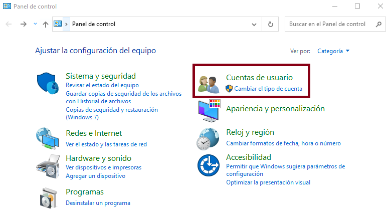
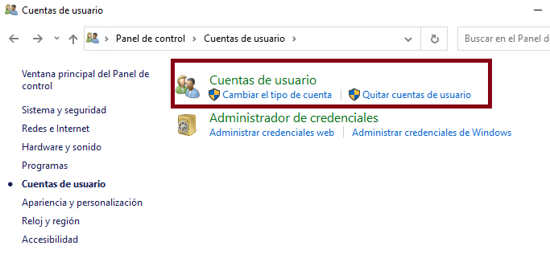
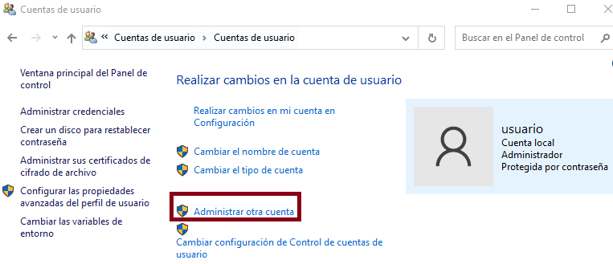
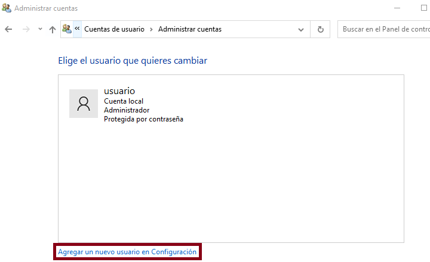
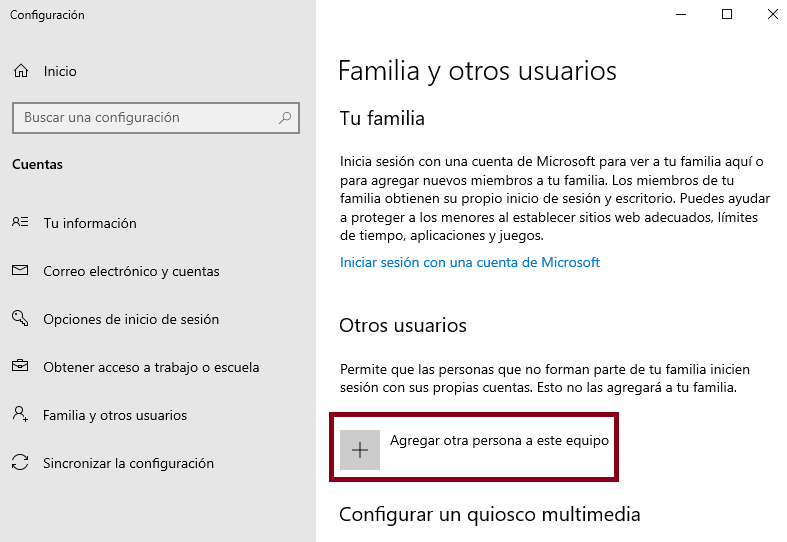
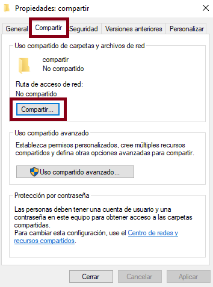
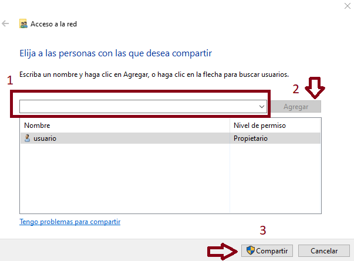

# SOM

## Programación estructurada en PowerShell
El primer paso que debemos realizar en nuestra máquina virtual de W10, es la ejecución del siguiente comando (en una ventana de powershell con permisos de administrador):
``` ps1
Set-ExecutionPolicy Unrestricted
```

### Declaración de variables
``` ps1
$variable = valor
```
Por ejemplo:
``` ps1
#System.Int32
$entero = 3
#System.String
$cadenaDeCaracteres = "Hola" 
```
### Entrada y salida 
Para poder mostrar por pantalla el valor de una variable o de una operación utilizaremos la función:
``` ps1
Write-Host $variable
Write-Host ($operando1 + $operando2)
```
Para poder recibir valores por teclado (y asignarlos a una variable), utilizaremos la función:
``` ps1
$variable = Read-Host "Mensaje"
```
Por ejemplo:
``` ps1
[int]$edad = Read-Host "Por favor, introduzca su edad"
```
!!! tip
    La función ```Read-Host``` devuelve siempre una variable cadena de texto. Si queremos almacenar en nuestra variable un número entero tendremos que declararlo de forma explícita utilizando ```[int]```

### Argumentos de llamada a un script .ps1
Podemos pasarle a nuestro script los valores que queramos como argumentos:
``` ps1
./script.ps1 1 2 3
```
Dentro de nuestro script, podremos recuperar estos valores de la siguiente manera:
``` ps1
$primerNumero = $args[0]
$segundoNumero = $args[1]
$tercerNumero = $args[2]
```

### Operadores de comparación
Estos operadores los utilizaremos tanto en las sentencias condicionales como en los bucles:

**-eq** (equal to):igual a

**-lt** (less than): menos que

**-gt** (greater than): más que

**-ge** (greater than or equal to): mayor o igual a

**-le** (less than or equal to): menor o igual a

**-ne** (not equal to): no es igual a

### Operaciones lógicas

**-and** Permite relacionar varios predicados condicionales. Para que el predicado global sea verdadero, tienen que ser verdaderos todos los predicados relacionados.
``` ps1
if ( ($num1 -gt 5) -and ($num2 -gt 5) )
{
    Write-Host "Los dos números son mayores que 5"
}
```

**-or** Permite relacionar varios predicados condicionales. Para que el predicado global sea verdadero, tiene que ser verdadero, al menos uno de los predicados relacionados.
``` ps1
if ( ($num1 -gt 5) -or ($num2 -gt 5) )
{
    Write-Host "Al menos uno de los dos números son mayores que 5"
}
```

**-not** Permite negar predicados condicionales.
``` ps1
if ( -not($num -gt 5) )
{
    Write-Host "El número no es mayor que 5"
}
```

### Sentencias condicionales

#### IF
```ps1
$a=5

if($a -eq 5)

{

Write-Host "5"

}
```

#### IF-ELSE
```ps1
$a=5

if($a -eq 5)

{

    Write-Host "La variable a tiene asignado el valor 5"

}

else

{

    Write-Host "La variable a no tiene asignado el valor 5"

}
```

#### ELSEIF
```ps1
$a=6

if($a -eq 5)

{

    Write-Host "La variable a tiene asignado el valor 5"

}

elseif($a -eq 6)

{

    Write-Host "La variable a tiene asignado el valor 6"

}

else

{

    Write-Host "La variable a no tiene asignado ni el valor 5 ni el 6"

}
```
#### SWITCH
```ps1
$a=5

switch($a)
{

    5
    {
        Write-Host "La variable a tiene asignado el valor 5"
        break
    }

    6
    {
        Write-Host "La variable a tiene asignado el valor 6"
        break
    }

    7
    {
        Write-Host "La variable a tiene asignado el valor 7"
        break

    }
    default
    {
        Write-Host "La variable a no tiene asignado ni el valor 5 ni el 6 ni el 7"
    }

}
```

### Bucles (Sentencias de repetición)

#### WHILE
``` ps1
$i=1
while($i -le 10)
{
    $i
    $i++
}
```

#### DO-WHILE
``` ps1
$i=1
do{
    $i
    $i++
}while($i -le 10)
```

#### FOR
``` ps1
for($i=1;$i -le 10;$i++)
{
    $i
}
```

#### FOREACH
``` ps1
foreach($i in 1..10)
{
    $i
}
```

### Función random
La función Get-Random nos permite obtener valores aleatorios.

``` ps1
#Obtener un número aleatorio entre 0 y 100
Get-Random -Minimum 0 -Maximum 100
```

``` ps1
#Obtener dos colores aleatorios de la lista
'verde', 'amarillo', 'rojo', 'azul', 'negro', 'blanco' | Get-Random -Count 2
```

``` ps1
#Reorganiza de forma aleatoria toda la lista de colores
'verde', 'amarillo', 'rojo', 'azul', 'negro', 'blanco' | Get-Random -Shuffle
```

### Funciones de cadenas de caracteres
#### Length
Muestra la longitud de una cadena de caracteres
```ps1
$c = 'casa'
$c.length
4
```

#### IndexOf
Muestra la posición de la primera ocurrencia de un carácter dentro de una cadena de texto. En caso de que el carácter no esté dentro de la cadena de texto devuelve -1.
```ps1
$c = 'casa'
$c.indexOf('c')
0
$c.indexOf('s')
2
$c.indexOf('w')
-1
```

#### Replace
Reemplaza una sección de una cadena de caracteres por otra.
```ps1
$c = 'casa'
$c.replace('ca','pa')
pasa
```

#### Insert
Introduce en una posición de una cadena de texto, otra cadena de texto.
```ps1
$c = 'casa'
$c.insert(4.'s')
casas
```

#### Equals 
Evalúa si una cadena de caracteres es igual a otra. Devuelve los valores booleanos True o False.
```ps1
$c = 'casa'
$c1 = 'casa'
$c2 = 'pasa'
$c.equals('casa')
True
$c.equals('pasa')
False
$c.equals($c2)
False
$c.equals($c1)
True
```

#### Split y Substring
Lo veremos en próximos capítulos.

## Ejercicios resueltos

### Contador de 1 a 10 utilizando el bucle WHILE
```ps1
$i = 1
while($i -le 10)
{
    Write-Host($i) 
    $i++
}
```

### Sensor de temperatura con ELSEIF
```ps1
[int]$temp = Read-Host "Por favor, introduzca la temperatura"
if ($temp -le 10)
{
    Write-Host "Frío"
}
elseif ($temp -gt 10 -and $temp -le 18)
{
    Write-Host "Fresquito"
}
elseif ($temp -gt 18 -and $temp -le 24)
{
    Write-Host "Temperatura agradable"
}
else
{
    Write-Host "Calor"
}
```

### Semáforo con SWITCH
```ps1
$color = $args[0]
switch($color)
{
    'verde'
    {
        Write-Host "Pasar"
        break
    }
    'amarillo'
    {
        Write-Host "Precaución"
        break
    }
    'rojo'
    {
        Write-Host "Parar"
        break
    }
    default
    {
        Write-Host "Color inválido"
    }
}
```

### Recorrer una lista utilizando el bucle FOR
```ps1
$frutas = 'fresa', 'manzana', 'platano', 'melon', 'naranja', 'limon'
for ($i=0; $i -lt $frutas.length; $i++)
{
    Write-Host $frutas[$i]
}
```

### Obtener N elementos de una lista de manera aleatoria
```ps1
$frutas = 'fresa', 'manzana', 'platano', 'melon', 'naranja', 'limon'
[int]$numFrutas = Read-Host "¿Cuántas frutas quiere?"
$frutas | Get-Random -Count $numFrutas
```

### Comprobar si una letra está presente en una palabra
```ps1
$palabra = 'casa'
$letra = Read-Host "Por favor, introduzca una letra"
if ($palabra.IndexOf($letra) -ne -1 )
{
    Write-Host "La letra está presente en la palabra"
}
else
{
    Write-Host "La letra NO está presente en la palabra"    
}
```

### Eliminar de una lista las palabras que comienzan por vocal
```ps1
$alumnos = 'Iker', 'Desirée', 'Andrei', 'Pablo', 'Aitor', 'Manuel', 'Mario', 'Daniel', 'Edwar', 'Nicolás'
for ($i=0; $i -lt $alumnos.length; $i++)
{
    $alumno = $alumnos[$i]
    $pl = $alumno[0]
    if ($pl -eq 'a' -or $pl -eq 'e' -or $pl -eq 'i' -or $pl -eq 'o' -or $pl -eq 'u')
    {
        $alumnos[$i] = '----'
    }
}
$alumnos
```

### Mostrar los personajes cuyo nombre y apellido comienzan por la misma letra
```ps1
$personajes = 'Peter Parker', 'Hercule Poirot', 'Stephen Strange', 'Harry Potter', 'Reed Richards', 'Matt Murdock', 'Oliver Twist'
$personaje = ''
$espacio = -1
$primeraLetraNombre = ''

for ($i=0;$i -lt $personajes.length;$i++)
{
	$personaje = $personajes[$i]
	$primeraLetraNombre = $personaje[0]
	for ($j = 0; $j -lt $personaje.length; $j++)
	{
		if ($personaje[$j] -eq ' ')
		{
				$espacio = $j
		}
	}
	if ($primeraLetraNombre -eq $personaje[$espacio + 1])
	{
		Write-Host $personaje
	}
}
```

## Examen 07/03/2022

### Pregunta 1 - Escribe un script que reciba 3 argumentos (utiliza $args): Le preguntará al usuari@ su nombre y apellidos y se lo mostrará por pantalla con el siguiente formato: apellido1 apellido2, nombre
```ps1
Write-Host $args[1] $args[2]','$args[0]
```
(Alternativa) Utilizando Read-Host y 3 variables
```ps1
$nombre = Read-Host "Introduzca su nombre"
$apell1 = Read-Host "Introduzca 1er apellido"
$apell2 = Read-Host "Introduzca 2º apellido"
Write-Host $apell1 $apell2', '$nombre
```

### Pregunta 2 - Escribe un script que genere un número aleatorio entre 0 y 50. Si el número resultante es 10 20 30 o 40 escribe “¡Has tenido suerte!”
```ps1
$num = Get-Random -Minimum 0 -Maximum 50
if ($num -eq 10 -or $num -eq 20 -or $num -eq 30 -or $num -eq 40)
{
	Write-Host "Has tenido suerte"	
}
```

### Pregunta 3 - Escribe un script calculadora en el que declares 2 variables (serán los operandos) y admita un argumento para seleccionar el tipo de operación a realizar mediante la estructura switch. El/la usuari@ puede elegir entre la operación de suma y la de multiplicación.

``` ps1
$op1 = 2
$op2 = 3
$op = $args[0]
switch($op)
{
+
	{
		Write-Host ($op1 + $op2)
		break
	}
*
	{
		Write-Host ($op1 * $op2)
		break
	}
}
```

### Pregunta 4 - Escribe un script que muestre los números del 15 al 1(orden descendente) mediante un bucle.
``` ps1
for ($i = 15;$i -gt 0;$i--)
{
	Write-Host $i
}
```
### Pregunta 5 - Script que muestre únicamente las palabras en plural (terminan por la letra s) de la siguiente lista: casa, aceitunas, verdura, futbolista, pilas, cosas
``` ps1
$lista = 'casa', 'aceitunas', 'verdura', 'futbolista', 'pilas', 'cosas'
for($i = 0; $i -lt $lista.length; $i++)
{
	$palabra = $lista[$i]
	if ($palabra[$palabra.length-1] -eq 's')
	{
		Write-Host $palabra	
	}
}
```
## Ejercicios repaso recuperación 21/03/2022

### 1. Script que pinte todos los argumentos mediante un bucle con la siguiente salida:
Argumento 1 - valorArgumento1
Argumento 2 - valorArgumento2
Argumento 3 - valorArgumento3
Argumento N - valorArgumentoN

### 2. Crea una lista con las letras del abecedario:
- En una primera versión: Muestra la primera, la quinta y la octava letra.
En una segunda versión:
- Pregúntale al usuari@ cuantas letras aleatorias quiere obtener. 
- Si alguna de las letras obtenidas es una vocal, muestra el siguiente mensaje: Has tenido suerte!

### 3. Crea un script que convierta una nota numérica a formato texto:
- Si la nota es menor que 5 - Escribe suspenso
- Si la nota es mayor o igual a 5 y menor que 6 - Escribe aprobado
- Si la nota es mayor o igual a 6 y menor que 7 - Escribe bien
- Si la nota es mayor o igual a 7 y menor que 9 - Escribe notable
- Si la nota es mayor o igual a 9 y menor que 10 - Escribe sobresaliente
- Si la nota es igual a 10 - Escribe Matrícula de honor
- Si la nota está fuera de estos rangos - Escribe valor inválido

### 4. Crea un script que contenga un bucle que muestre los números impares del 1 al 19

## Comandos Powershell

### New-Item
Nos permite crear ficheros ```-ItemType "file"``` y carpetas ```-ItemType "directory"``` especificando la ruta del nuevo elemento mediante -Path.
[Ejemplos](https://docs.microsoft.com/en-us/powershell/module/microsoft.powershell.management/new-item?view=powershell-7.2#example-1-create-a-file-in-the-current-directory)

### Remove-Item
Permite eliminar ficheros y carpetas.
[Ejemplos](https://docs.microsoft.com/es-es/powershell/scripting/samples/manipulating-items-directly?view=powershell-7.2#deleting-items-remove-item)

### Copy-Item
Permite copiar ficheros y carpetas en nuestro sistema de archivos.
[Ejemplos](https://docs.microsoft.com/es-es/powershell/scripting/samples/manipulating-items-directly?view=powershell-7.2#copying-items-copy-item)

### Move-Item
Permite mover ficheros y carpetas en nuestro sistema de archivos.
[Ejemplos](https://docs.microsoft.com/es-es/powershell/scripting/samples/manipulating-items-directly?view=powershell-7.2#moving-items-move-item)

### Compress-Archive
Nos permite comprimir archivos y carpetas.
[Ejemplos](https://docs.microsoft.com/en-us/powershell/module/microsoft.powershell.archive/compress-archive?view=powershell-7.2#example-3-compress-a-directory-that-includes-the-root-directory)

### Expand-Archive
Nos permite descomprimir archivos .zip.
[Ejemplo](https://docs.microsoft.com/en-us/powershell/module/microsoft.powershell.archive/expand-archive?view=powershell-7.2#example-2-extract-the-contents-of-an-archive-in-the-current-folder)

### Add-Content
Nos permite añadir texto ```-Value``` a un fichero ```-Path```.
[Ejemplos](https://docs.microsoft.com/en-us/powershell/module/microsoft.powershell.management/add-content?view=powershell-7.2)

### Get-Content
Permite visualizar el contenido de un fichero de texto.
[Ejemplos](https://docs.microsoft.com/en-us/powershell/module/microsoft.powershell.management/get-content?view=powershell-7.2)

### Clear-Content
Permite eliminar el contenido de un fichero de texto.
[Ejemplos](https://docs.microsoft.com/en-us/powershell/module/microsoft.powershell.management/clear-content?view=powershell-7.2)

### Get-Date
Muestra la fecha actual en distintos formatos
[Ejemplos](https://docs.microsoft.com/en-us/powershell/module/microsoft.powershell.utility/get-date?view=powershell-7.2)

#### Ejercicio resuelto
1. Crea la carpeta ejercicioRepaso en el escritorio con el siguiente contenido:  
uno.txt  
dos.html  
tres.txt  
cuatro.html
```ps1
New-Item -Path C:\Users\usuario\Desktop\ejercicioRepaso -ItemType "directory"
New-Item -Path C:\Users\usuario\Desktop\ejercicioRepaso\uno.txt -ItemType "file"
New-Item -Path C:\Users\usuario\Desktop\ejercicioRepaso\dos.html -ItemType "file"
New-Item -Path C:\Users\usuario\Desktop\ejercicioRepaso\tres.txt -ItemType "file"
New-Item -Path C:\Users\usuario\Desktop\ejercicioRepaso\cuatro.html -ItemType "file"
```
2. Crea una carpeta en Documentos llamada web y copia los archivos .html de ejercicioRepaso a esta nueva carpeta:
```ps1
New-Item -Path C:\Users\usuario\Documents\web -ItemType "directory"
Copy-Item -Path C:\Users\usuario\Desktop\ejercicioRepaso\*.html -Destination C:\Users\usuario\Documents\web
```
3. Comprime la carpeta web en Documentos:
```ps1
Compress-Archive -Path C:\Users\usuario\Documents\web\* -DestinationPath C:\Users\usuario\Documents\web.zip
```
4. Mueve la carpeta web.zip de Documentos a Escritorio:
```ps1
Move-Item -Path C:\Users\usuario\Documents\web.zip -Destination C:\Users\usuario\Desktop
```
5. Elimina la carpeta web (y todo su contenido) de Documentos:
```ps1
Remove-Item C:\Users\usuario\Documents\web -Recurse
```
6. Descomprime web.zip (en el Escritorio):
```ps1
Expand-Archive -Path C:\Users\usuario\Desktop\web.zip -DestinationPath C:\Users\usuario\Desktop\web
```
### Ejemplo de menú simple en PowerShell
```ps1
[int]$opcion = -1
while ($opcion -ne 4) {
Write-Host "1. Opción 1"
Write-Host "2. Opción 2"
Write-Host "3. Opción 3"
Write-Host "4. Salir"
$opcion = Read-Host "Seleccione una opción"
    switch ($opcion) {
        1{Write-Host "Seleccionaste la opcion 1"}
        2{Write-Host "Seleccionaste la opcion 2"}
        3{Write-Host "Seleccionaste la opcion 3"}
        4{Write-Host "Saliendo del script..."}
    }
}
```
### Creación de una cuenta de usuario en W10
Paso 1:  
  
Paso 2:  
  
Paso 3:  
  
Paso 4:  
  
Paso 5:  


### Compartir una carpeta en W10
Paso 1:  
Click derecho ratón encima de la carpeta a compartir -> Propiedades  
  
Paso 2:  
1. Seleccionamos el usuario con el que queremos compartir la carpeta.  
2. Clickamos en el botón agregar.  
3. Clickamos en el botón compartir.  


## Ubuntu
### Creación de un grupo en Linux
```bash
sudo groupadd nombreGrupo
```
Podemos consultar los grupos existentes en nuestra sistema en /etc/group
### Creación de un usuario en Linux
```bash
sudo useradd -m nombreUsuario -G nombreGrupo -s /bin/bash
```
Parámetros opcionales:  
```-m``` crea una carpeta home para el nuevo usuario en /home/nombreUsuario  
```-G``` añade al usuario recién creado a un grupo que exista en el sistema  
```-s``` Estable la terminal por defecto del usuario   
Podemos consultar los usuarios existentes en nuestra sistema en /etc/passwd
